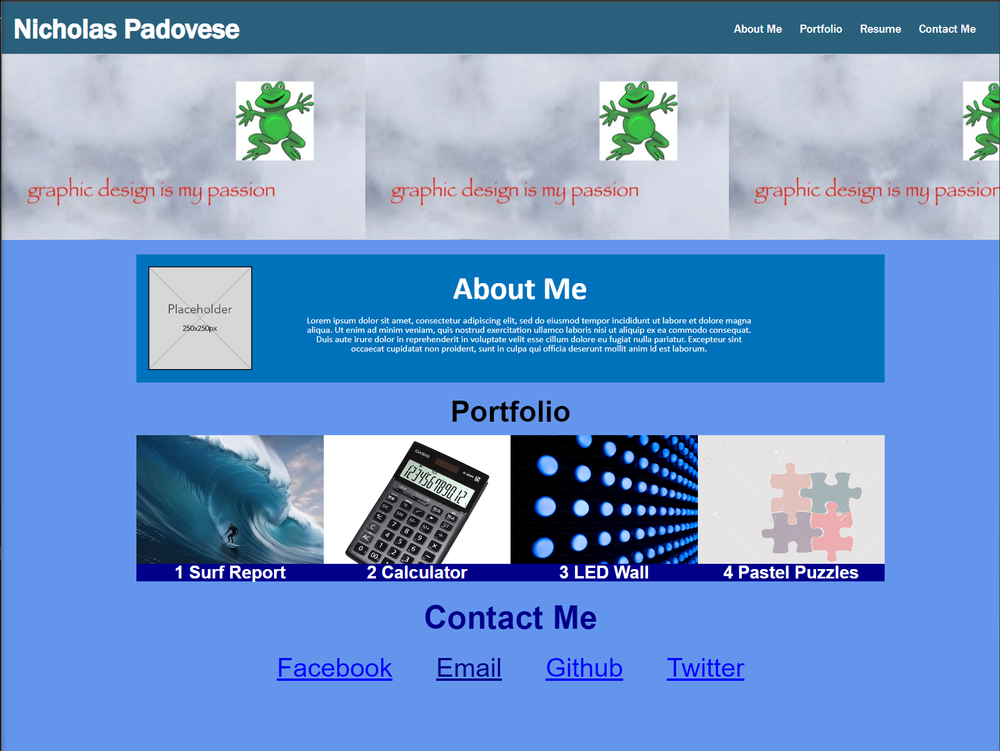

## Portfolio Assignment README

## Introduction
This README file provides an overview of my portfolio assignment, highlighting its purpose, features, technologies used, installation instructions, usage guidelines, and more. It is intended to give you a clear understanding of the work presented in my portfolio.

## Project Overview
Project Name: Portfolio
Description: The intention behind the portfolio project is to build a foundation for a personal portfolio that I will use to display future projects.
Live Demo: https://interuptingcow.github.io/My-Portfolio/
Author: Nicholas Padovese

## Description

My portfolio is designed to provide a comprehensive view of my capabilities, projects, and achievements. It serves as a personal branding tool, an interactive resume, and a platform to connect with potential employers, collaborators, and fellow enthusiasts in the community. Through this portfolio, I aim to convey my skills, knowledge, and passion and present a strong case for why I'm an ideal candidate for opportunities in this domain in the future.

## Features

Showcase my projects: Highlight various projects I have worked on, providing descriptions and links.

Display my skills: List my technical skills and competencies.

Contact information: Provide a way for potential employers or collaborators to reach out to me.

## Technologies Used

HTML, CSS were all that was used to make the website.  It hodls potention for additional languages to be used once my understanding of them improves.

## Usage

On the homepage, you can find a list of my projects with brief descriptions and links.

Click on a project name to view more details about the project, including screenshots and a link to the live demo (if available).

Use the contact page to get in touch with me for collaboration or job opportunities.

## Screenshots

